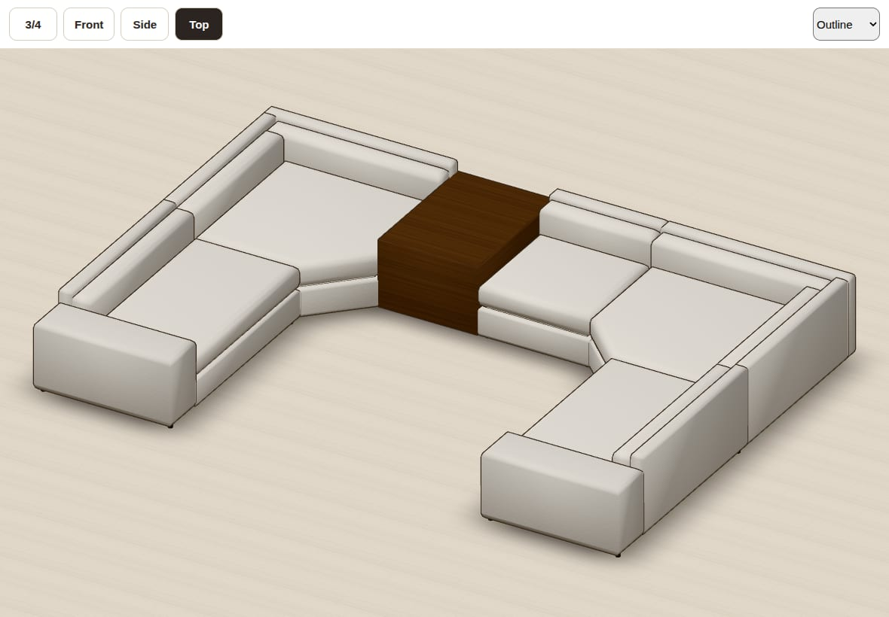
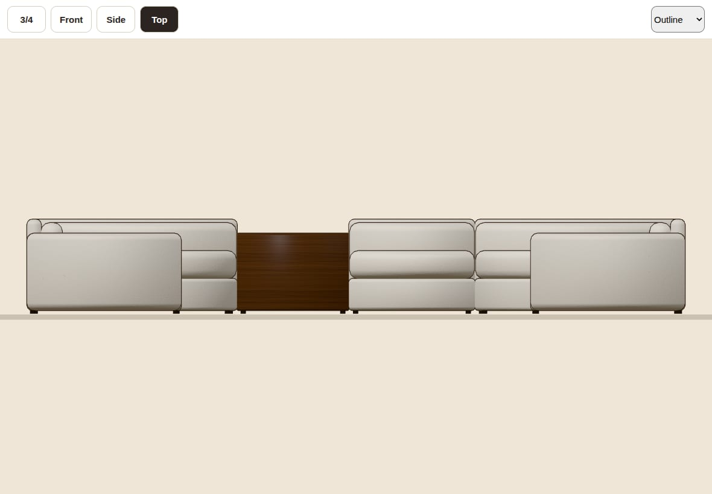
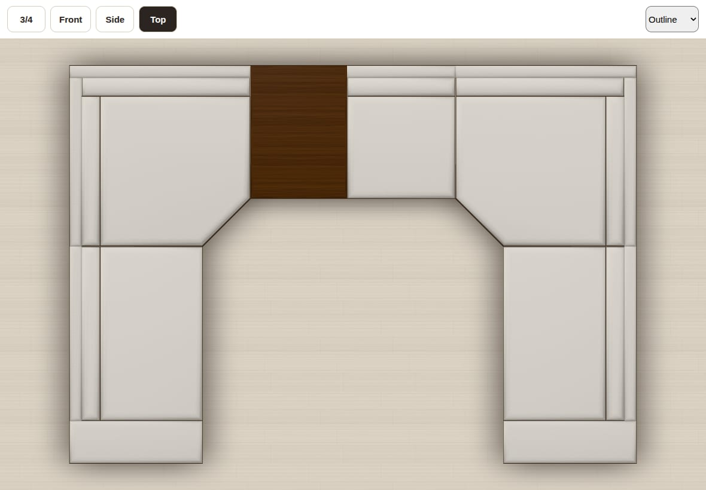
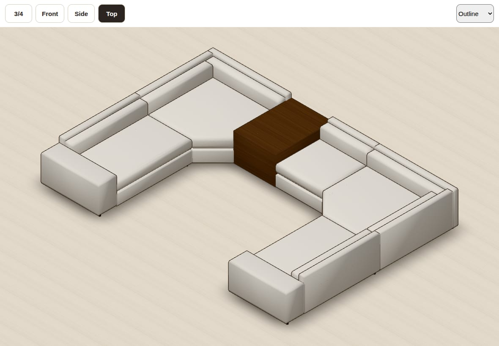

# Haven Configurator: docs

Planned 2026-09-24, re-planned 2026-09-25 as a standalone app (own repo, own Vercel project). **Not started:** no app code exists yet. Paths below are relative to `docs/`.

| File | What it is |
|---|---|
| [`HAVEN-PLAN.md`](HAVEN-PLAN.md) | **The build plan.** Wherever it differs from the spec, the plan wins. Start with §1 (TL;DR), §10 (milestones) and §13 (open questions). |
| [`spec-v3.md`](spec-v3.md) | Andre's original build spec, unchanged. |
| `prototypes/engine-a/` | The chosen geometry engine prototype. It passes all nine spec §12 tests plus edge tests (43/43). H1 ports it. |
| `prototypes/planview/` | Prototypes for the SVG plan view, dimensions, share-link codec, store and undo, table snapping, sheets, and the touch editor. `src/engine/` was left out because it is byte-identical to engine-a's. |
| `prototypes/ortho-demo/` | The orthographic R3F viewer demo: presets, the ortho fit, depth cues, and Playwright scripts. |
| `prototypes/placement/` | `check-bundle.mjs`, the starting point for the repo's entry-chunk budget check (plus a historical diff from the v1 placement study). |
| `evidence/` | Screenshots and sample PDFs referenced by the plan (listed below). |

The prototypes are reference code to port, never import. To re-run one, run `npm install` in its folder, then `npx vitest run` (engine-a) or `npx vite` (ortho-demo). `docs/**` is excluded from the app's lint (`.oxlintrc.json`), and the app's `tsc` and `vite build` never read it.

## Must answer before building

- **Q1** (before H3): does "orthographic" mean the 3D camera (flat, to-scale views you can still orbit), a drafting sheet (plan + front + side laid out together), or both? The plan assumes the camera.

Q2 (where it lives) is answered: a standalone app. Q3 no longer applies. Every other question in plan §13 has a default; Q9, Q10 and Q12–Q14 must be answered or accepted before H3.

## Evidence

The Standard U (spec test 1) in the orthographic demo, iPad landscape:

| 3/4 (trimetric 30°/30°, default) | Front elevation (true heights 1 / 18 / 23 / 27″) |
|---|---|
|  |  |
| **Top (lines up with the SVG plan to within 1e-4 px)** | **Iso (one scale on all three axes, × 0.8165)** |
|  |  |

- Right side elevation: [`evidence/ortho-side.jpg`](evidence/ortho-side.jpg)
- Third-angle drafting composite (plan, front, right side, all at 4 px/in): [`evidence/ortho-third-angle-sheet.jpg`](evidence/ortho-third-angle-sheet.jpg)
- SVG plan view with CAD dimensions: Standard U [`evidence/plan-standard-u.png`](evidence/plan-standard-u.png), and spec test 3b [`evidence/plan-test-3b.png`](evidence/plan-test-3b.png)
- Sample vector PDFs at 3/8″ = 1′-0″: shop sheet [`evidence/standardU-shop-cad.pdf`](evidence/standardU-shop-cad.pdf), client sheet [`evidence/standardU-client-jpeg.pdf`](evidence/standardU-client-jpeg.pdf)

These are prototype renders: the procedural sofa geometry is a stand-in until the H3/H5 craft questions (Q9–Q16) are answered.
